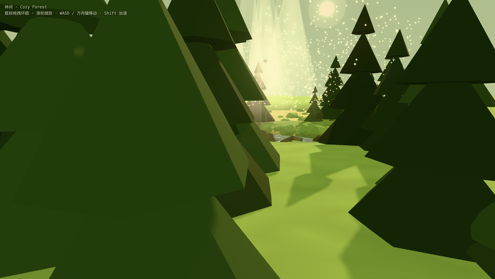

# Cozy Forest · Three.js

A walkable forest-stream scene built with Three.js.

The look is inspired by [this post from Protopop Games](https://x.com/protopop/status/2065613107729145977) showing their game *Cozy Country* — a bright grassy valley with a foamy stream running through it. This project recreates that mood entirely procedurally: every texture (leaf clusters, bark, flowers, rocks, ground) is drawn on canvas at runtime, with no external art assets.

## Preview



| | |
|---|---|
|  |  |
|  | |

## Highlights

- 60k instanced grass tufts with a baked root-to-tip color gradient and wind sway
- Card-foliage tree crowns (deciduous, birch, spruce) with alpha-tested depth materials for dappled sunlight shadows
- A meandering stream valley with an animated foam ribbon, reflective water, and rounded textured boulders
- Lupine-like flower spikes and meadow flowers along the banks
- Blazing summer-afternoon light: high golden sun, saturated blue sky, ACES tone mapping, a faint heat haze in the far distance

## How the scene data is stored

There is **no map file, no saved assets, and no serialization step**. The entire
scene is regenerated from scratch on every page load, deterministically. The
"database" is the source code itself plus one PRNG seed.

### 1. Determinism — the seed is the save file

`main.js` replaces `Math.random` with a seeded PRNG (mulberry32, seed
`20250614`) before any scene module runs. Every tree position, leaf card
rotation, rock shape and grass tuft comes from that one stream of random
numbers, so the forest is byte-for-byte identical on every load. Changing the
seed generates a different forest; the seed effectively *is* the map data.

### 2. The terrain is a function, not a heightmap

No elevation grid is stored. `terrain.js` exposes `terrainHeight(x, z)` which
computes height analytically on demand: the stream centreline (9 control
points through a Catmull-Rom curve in `streamPath.js`), a table of 7 waterfall
drops (`DROPS`), a channel-width function, and layered sine noise for the
hills. The ground mesh, grass placement, tree placement and water ribbon all
sample these same functions, which is how they stay consistent without sharing
any stored data.

### 3. Leaves — texture pixels + merged geometry + instance matrices

Leaves exist at three levels, none of them stored on disk:

- **Pixels**: each leaf-cluster texture is drawn at runtime on a `<canvas>`
  (~170 ellipses with random hue/size) and uploaded as a `CanvasTexture`.
  No image files ship with the project.
- **Geometry**: one tree *variant* merges all its leaf cards (small textured
  quads), tier blobs and trunk into single `BufferGeometry` objects — plain
  `Float32Array` attributes (position / normal / uv). A tiered-canopy variant
  is ~100 cards ≈ 400 vertices ≈ a few dozen KB of GPU buffer.
- **Instances**: every actual tree in the world is just one entry in an
  `InstancedMesh`: a 4×4 transform matrix (64 bytes) plus an RGB tint
  (12 bytes). ~380 trees, 60 000 grass tufts, ~600 rocks and ~2 000 flowers
  are all stored this way — e.g. the whole grass field is a single
  `instanceMatrix` Float32Array of about 3.8 MB living on the GPU, drawn in
  one call.

### 4. If you wanted to serialize it

Nothing is persisted today (no JSON, no localStorage, no glTF). Because
generation is deterministic, the honest serialization format is
`{ seed: 20250614, codeVersion: <git sha> }`. To export a frozen snapshot
instead, you would walk each `InstancedMesh` and dump `instanceMatrix.array`
(+ `instanceColor.array`) to JSON or a glTF with `EXT_mesh_gpu_instancing` —
a few MB total — and rebuild by feeding those arrays back into
`setMatrixAt`/`setColorAt`.

## Controls

| Action | Input |
|--------|-------|
| Look around | Mouse drag |
| Zoom | Scroll wheel |
| Move | WASD / arrow keys |
| Sprint | Shift |

## Setup

```bash
npm install
npm run dev
```
